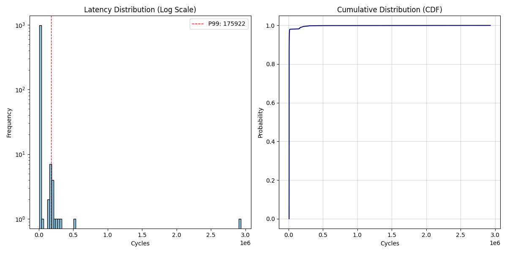

# HFT-Kernel-Sandbox: Low-Latency Zero-Copy Infrastructure (v3.1)

A high-performance Linux Kernel experiment focused on minimizing User-Kernel communication overhead. This project evolved from a basic shared-memory proof-of-concept into a **Lock-Free SPSC Ring Buffer** architecture, achieving deterministic, "Zero-Copy" data transfer—a critical requirement in High-Frequency Trading (HFT) systems where every nanosecond counts.

## The Goal
In HFT, standard Linux I/O operations (like `read`, `write`, or `recv`) introduce significant latency due to context switching and data copying. The objective of this project is to:
1.  **Eliminate the Context Switch Tax** by moving from blocking `read()` to asynchronous shared-memory polling.
2.  **Optimize for Determinism** using a cache-aligned SPSC (Single Producer Single Consumer) Ring Buffer.
3.  **Bypass OS Jitter** through strict CPU isolation and affinity.

## Environment Settings
The project was developed and tested in a strictly controlled sandbox environment:
* **Host OS:** Ubuntu 22.04 (Build Server)
* **Target Kernel:** Linux 5.4.0 (Custom Build)
* **Architecture:** x86_64
* **Emulation:** QEMU (SMP 2, `isolcpus=1` enabled)
* **Toolchain:** GCC (Static Linking), BusyBox (Initramfs)
* **Performance Tracking:** Hardware-level `rdtsc` (Time Stamp Counter) with `mfence`.

---

## Implementation Details

### 1. Custom System Call (Entry 548)
Implemented a control plane in `kernel/sys.c` to manage the HFT infrastructure.
* **Mode 555:** Allocates physically contiguous memory using `get_order` and registers the `/dev/hft` device.
* **Mode 123:** Starts the Kernel Packet Simulator (1ms interval timer).
* **Mode 777:** Direct syscall return to measure raw mode-transition overhead.

### 2. SPSC Ring Buffer (The "HFT Path")
Developed a state-of-the-art communication channel that lives in shared memory:
* **Lock-Free Design:** Uses `smp_wmb` (Kernel) and `mfence` (User) memory barriers for synchronization without mutexes.
* **Cache-Line Alignment:** Pointers (`head`, `tail`) are aligned to **64-byte** boundaries to prevent **False Sharing**, ensuring the Producer (Core 0) and Consumer (Core 1) do not invalidate each other's L1 cache.
* **Busy Polling:** The User-space engine spins on the `head` pointer for instantaneous reaction to kernel events.

### 3. Blocking I/O (The "Standard Path")
Implemented a `wait_queue` in the kernel driver to provide a fair comparison against traditional Linux I/O.
* **Mechanism:** User-space calls `read()`, the kernel puts the process to sleep, and the Timer interrupt executes `wake_up()` to reschedule the process.

---

## Benchmark Results
Actual measurements taken within the QEMU sandbox (Cycles represent CPU clock ticks). 1,000 samples per test.

| Method | P50 (Median) | P99 (Tail) | P99.9 (Extreme) | Architecture |
| :--- | :--- | :--- | :--- | :--- |
| **Standard (Blocking)** | **570,492** | **965,693** | **1,383,176** | Syscall + Context Switch |
| **v2.0 (Shared Mem)** | **16,882** | **183,610** | **366,469** | Pinned + Basic mmap |
| **v3.1 (SPSC Ring)** | **8,190** | **11,634** | **63,280** | **Pinned + Cache Aligned** |

> **Conclusion:** Moving from Standard I/O to the v3.1 Ring Buffer resulted in a **~70x reduction** in median latency and an **~83x reduction** in tail latency (P99). This proves that eliminating context switches and OS scheduling is vital for HFT determinism.

---

## Execution Guide

### 1. Compilation
**Kernel:**
```bash
cd ~/linux
make -j$(nproc) bzImage
```

**User-Space:**
```bash
# Standard Path
gcc -static lat_test_v0.c -o ./rootfs/bin/lat_v0
# HFT Path (v3.1)
gcc -static -march=x86-64 -I. lat_test_v3.c -o ./rootfs/bin/lat_v3
```

### 2. Packaging & Launch
**Build Initramfs:**
```bash
cd ~/hft-sandbox/rootfs
find . -print0 | cpio --null -ov --format=newc | gzip -9 > ../initramfs.cpio.gz
```

**Run QEMU (Crucial for Isolation):**
```bash
qemu-system-x86_64 \
    -m 1G -smp 2 \
    -kernel ~/linux/arch/x86/boot/bzImage \
    -initrd ~/hft-sandbox/initramfs.cpio.gz \
    -nographic \
    -append "console=ttyS0 nokaslr iomem=relaxed isolcpus=1 nohz_full=1"
```

### 3. Testing (Inside QEMU)
```bash
# Initialize and Create Node
mknod /dev/hft c 10 60

# Run Standard Baseline
/bin/lat_v0

# Run Optimized HFT Path (Pinned to Core 1)
taskset 0x2 /bin/lat_v3
```

## Performance Results
The final v3.1 implementation achieves a "Vertical Cliff" CDF, representing near-perfect determinism despite running in a virtualized environment.

